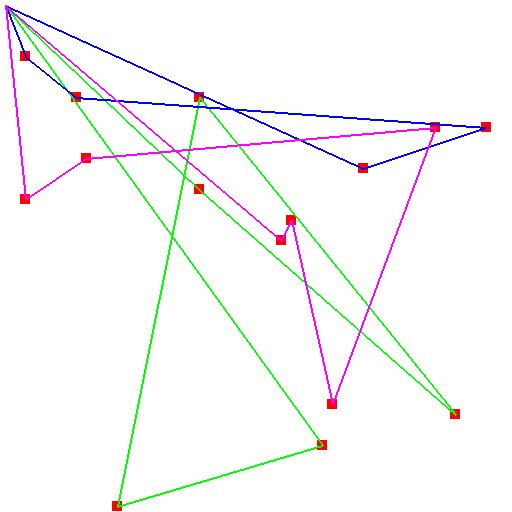
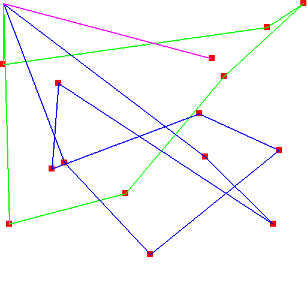

# MTSP with Reinforcement Learning Approaches

## Environments

This environment is built based on the [`gymnasium`](https://gymnasium.farama.org/) framework. You can refer to the [environment creation documentation](https://gymnasium.farama.org/tutorials/gymnasium_basics/environment_creation/) for examples. 

The modified environment includes:

### **`MTSPEnv(num_agents, num_tasks, map_boundary)`**  
This environment models the **Multiple Traveling Salesman Problem (MTSP)**. Below are its key characteristics:

#### **State Space**  
- The state is represented as a concatenated vector of:
  1. **Agent Positions**  
  2. **Binary Vector of Remaining Tasks**

#### **Action Space**  
- An action is defined as:  
  `a_ij = i * (task number) + j`  
  where:  
  - `i` is the task index.  
  - `j` is the agent index.  

  This action assigns **Task `i`** to **Agent `j`**.

#### **Transition Probabilities**  
- This is a **deterministic environment**, so the transition probabilities are:  
  ```
  P(s' | s, a) = 1, if the transition is valid (task is available)
  P(s' | s, a) = 0, otherwise
  ```

#### **Reward**  
- The reward is **inversely proportional** to the travel distance.

## Models 
- Deep-Q Network
The DQN code is implemented based on the examples that are shown [on youtube video](https://www.youtube.com/watch?v=wc-FxNENg9U&t=1697s&pp=ygULZHFuIHB5dG9yY2g%3D).
- PPO
The PPO algorithm is built based on the code of [nikhilbarhate99/PPO-PyTorch](https://github.com/nikhilbarhate99/PPO-PyTorch?tab=readme-ov-file)

## Results

The following plot visualizes the final solution obtained using 
- DQN

<p align="center">
  
</p>

- PPO
<p align="center">
  
</p>

## Using the code
Running the test of current training values

`python3 -m test.'algorithm'_test`

Change the `render_mode` in the test file for different visualization mode.