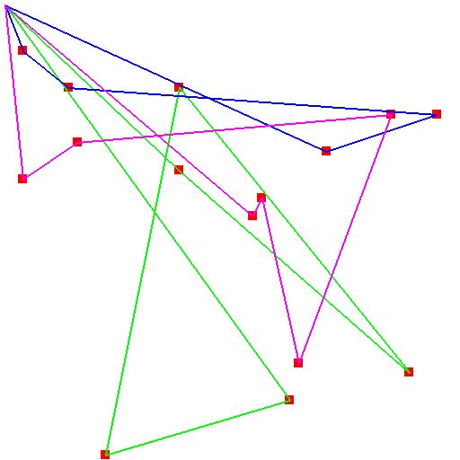

# MTSP with Reinforcement Learning Approaches

## Environments
This environment built base on the `gymnasium` environment. Examples are shown [on the environment creation documentation](https://gymnasium.farama.org/tutorials/gymnasium_basics/environment_creation/). The modified environment include:
- `MTSPEnv(num_agents,num_tasks,map_boundary)`: Multiple Traveling salesman Problem

## Deep-Q Network
The DQN code is implemented based on the examples that are shown [on youtube video](https://www.youtube.com/watch?v=wc-FxNENg9U&t=1697s&pp=ygULZHFuIHB5dG9yY2g%3D).

## Results

The following plot visualizes the final solution obtained using 
- DQN

  

